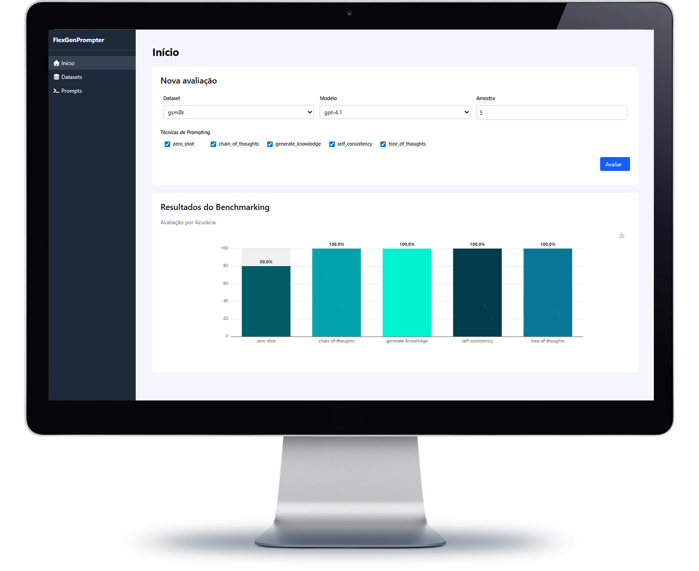

<div align="center">

  # FlexGenPrompter


  
  

  
  
</div>


## Manual de execução

### Execução com Docker

#### 1. Execute o comando para iniciar os containers dockers pela primeira vez
```
docker compose up --build -d
```
se você já executou esse comando, execute apenas o seguinte comando:
```
docker compose up -d
```

### Execução sem Docker

#### 1. Crie um ambiente venv do python
```
python -m venv env
```

#### 2. Inicialize o ambiente venv
```
source ./env/bin/activate
```


#### 3. Instale as dependências do projeto
```
pip install -r requirements.txt
```

#### 4. Crie as tabelas do banco de dados
```
python manage.py migrate
```

#### 5. Execute a aplicação
```
python manage.py runserver
```

#### 6. Execute o redis com Docker
> ⚠️ Para a instalação do Redis, é necessário o uso do WSL caso esteja utilizando o Windows.


No Windows/Linux:

##### 6.1 Atualize os pacotes
```
sudo apt update
```

##### 6.2 Instale o Redis
```
sudo apt install redis-server
```

##### 6.3 Verifique a instalação
```
redis-server --version
```

##### 6.4 Inicie o servidor
```
sudo service redis-server start
```

No MAC:

##### 6.1 Instale o redis
```
rew install redis
```

##### 6.2 Inicie o servidor
```
brew services start redis
```

### 7. Execute o worker do celery
```
celery -A flexgenprompter.celery worker -l info -P gevent
```
